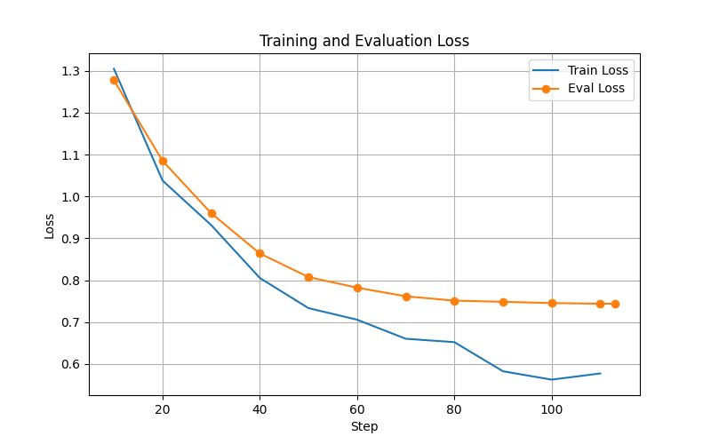
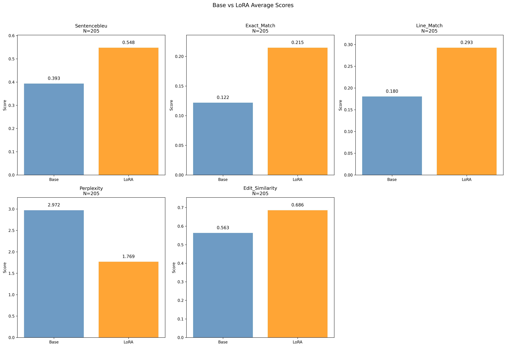
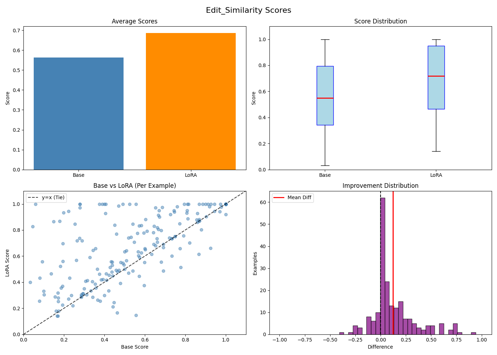
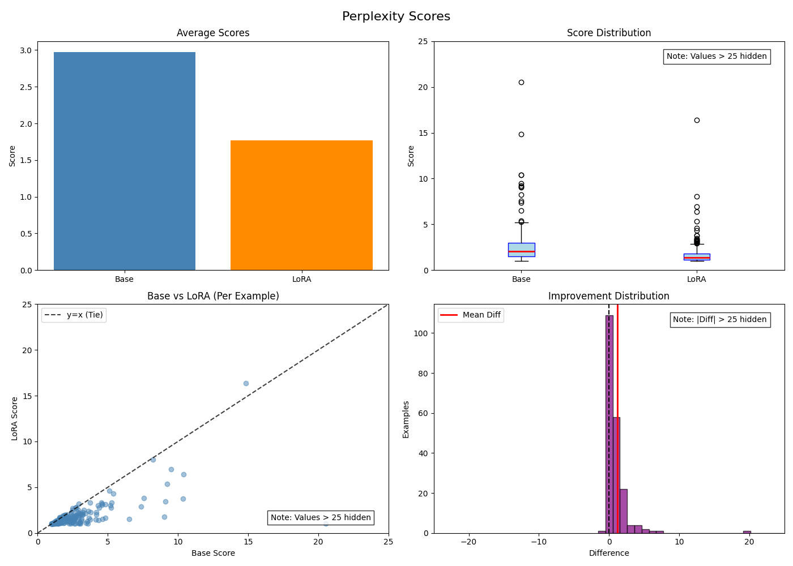

# Tutorial: Fine-Tuning on Structured Text (IEC 61131-3)

This guide walks through a complete CodeFinetuner run on [Structured Text (ST)](https://en.wikipedia.org/wiki/Structured_text), the Pascal-derived language defined in the IEC 61131-3 standard for programmable logic controllers. It uses the open-source [OSCAT library](https://github.com/PLC-lang/oscat) as training data and produces a LoRA-fine-tuned [Qwen2.5-Coder-3B](https://huggingface.co/Qwen/Qwen2.5-Coder-3B) model capable of completing ST code directly in your editor.

## Table of Contents
- [Why Fine-Tune on Structured Text?](#why-fine-tune-on-structured-text)
- [Data Source: The OSCAT Library](#data-source-the-oscat-library)
- [Data Preparation Pipeline](#data-preparation-pipeline)
- [Configuration](#configuration)
- [Running the Pipeline](#running-the-pipeline)
- [Results](#results)
  - [Training Loss](#training-loss)
  - [Metric Overview](#metric-overview)
  - [Edit Similarity](#edit-similarity)
  - [Perplexity](#perplexity)
- [Qualitative Examples](#qualitative-examples)
- [Finetuned Model](#finetuned-model)

## Why Fine-Tune on Structured Text?

Two factors make ST a strong candidate for fine-tuning over relying on a base model:

- Data Scarcity. ST is a niche industrial language with minimal public representation on GitHub. Base models like Qwen2.5-Coder have seen little to no ST during pre-training.
- Syntax Divergence. ST is Pascal-based: case-insensitive, with explicit block delimiters (`VAR_INPUT ... END_VAR`, `IF ... END_IF`) and the `:=` assignment operator. This deviates sharply from the C-family and indentation-based languages that dominate pre-training corpora, making naive completion unreliable.

Fine-tuning a LoRA adapter on a compact, domain-specific corpus directly addresses both issues.

## Data Source: The OSCAT Library

The training data comes from a single source: the monolithic `oscat.st` file in the [PLC-lang/oscat](https://github.com/PLC-lang/oscat/blob/main/oscat.st) repository. OSCAT (Open Source Community for Automation Technology) is a large, well-maintained open-source PLC function library covering mathematics, signal processing, and data handling, making it an ideal corpus for ST fine-tuning.

Note on industrial code distribution. In production environments, PLC software is typically distributed as pre-compiled, platform-specific libraries (e.g., CODESYS `.library` or Beckhoff TwinCAT `.plcproj` archives). Monolithic plain-text exports like `oscat.st` are rare, making this dataset particularly valuable for training.

## Data Preparation Pipeline

The raw `oscat.st` file is processed into three balanced split files (`train.st`, `eval.st`, `test.st`) through a three-step pipeline before being passed to CodeFinetuner. See `clear_st_code.py` script.

### Step 1 — Cleaning

Regular expressions strip non-executable elements from the file:

- Multi-line block comments (`(* ... *)`)
- Single-line annotations (`// ...`)
- Consecutive empty lines (collapsed to a single blank line)

This ensures the model trains only on pure code logic.

### Step 2 — Structural Block Extraction

Instead of slicing by character or line count, a regex pattern captures entire, syntactically valid top-level IEC 61131-3 structures from open to close:

- FUNCTION, FUNCTION_BLOCK, PROGRAM
- TYPE (structs/enums), VAR_GLOBAL, CONFIGURATION
- CLASS, INTERFACE, NAMESPACE, METHOD, PROPERTY

Each extracted block is a self-contained compilation unit, not an arbitrary text slice.

### Step 3 — Stratified Distribution

To prevent minority block types (such as TYPE or VAR_GLOBAL) from clustering in a single split, a stratified sampler applies an 80% / 10% / 10% train–eval–test split independently per block type, then shuffles the result within each split. This produces three files with identical structural distributions.

Place the output files in the following layout:

```text
data/
└── PLC-lang-oscat/
    ├── train/
    │   └── train.st
    ├── eval/
    │   └── eval.st
    └── test/
        └── test.st
```

Note: `split_mode: "manual"` is set in the configuration below, so CodeFinetuner reads directly from the `train`, `eval`, and `test` subdirectories and ignores the `train_ratio`, `eval_ratio`, and `test_ratio` parameters.

## Configuration

Create `config.yaml` in your working directory:

```yaml
# Shared across all stages
globals: &globals
  workspace_path: null  # null: defaults to current working directory (CWD)
  model_name: "unsloth/Qwen2.5-Coder-3B"
  fim_prefix_token: "<|fim_prefix|>"
  fim_middle_token: "<|fim_middle|>"
  fim_suffix_token: "<|fim_suffix|>"
  fim_pad_token: "<|fim_pad|>"
  eos_token: "<|endoftext|>"
  label_pad_token_id: -100
  max_token_sequence_length: 512 
  data_language: "iec61131_3_st"
  data_extensions: [".st"]
  use_unsloth: False

# Preprocess stage
preprocess:
  <<: *globals
  split_mode: "manual"
  train_ratio: 0.8  # ignored when split mode manual
  eval_ratio: 0.1   # ignored when split mode manual
  test_ratio: 0.1   # ignored when split mode manual
  max_code_blocks_ast_depth: 20
  min_middle_tokens_length: 10
  max_middle_tokens_length: 200
  fim_examples_per_subblock_ratio: 1
  rand_to_ast_fim_examples_ratio: 0.0  # 0 = no random fim examples are created
  rand_examples_min_prefix_suffix_tokens_length: 10
  tokenizer_batch_size: 32
  raw_data_path: data/PLC-lang-oscat  # null: defaults to <workspace_path>/data
  tree_sitter_parser_path: third_party/tree-sitter-iec61131-3-st/libtree-sitter-iec61131-3-st.dylib  # null: uses tree_sitter_language_pack parser
  tree_sitter_definitions_path: null  # null: uses package internal tree sitter definitions
  rng_seed: 0

# Finetune stage
finetune:
  <<: *globals
  model_attn_implementation: "sdpa"
  lora_r: 32
  lora_alpha: 64
  lora_dropout: 0.0
  lora_bias: "none"
  lora_target_modules: ["q_proj", "v_proj", "k_proj", "o_proj", "gate_proj", "down_proj", "up_proj"]
  selected_checkpoint_strategy: "best"  # "best" or "last"
  trainer_resume_from_checkpoint: null  # null->fresh start, "last"->take last checkpoint
  trainer_clear_checkpoint_dir: false
  trainer_num_train_epochs: 1
  trainer_per_device_train_batch_size: 1
  trainer_per_device_eval_batch_size: 1
  trainer_gradient_accumulation_steps: 16
  trainer_learning_rate: 5e-5
  trainer_weight_decay: 0.01
  trainer_max_grad_norm: 1.0
  trainer_lr_scheduler_type: "cosine"
  trainer_warmup_steps: 10
  trainer_gradient_checkpointing: true
  trainer_logging_steps: 10
  trainer_eval_strategy: "steps"
  trainer_eval_steps: 10
  trainer_save_strategy: "steps"
  trainer_save_steps: 10
  trainer_logging_strategy: "steps"
  dataset_shuffle_buffer_size: 50000
  dataset_shuffle_seed: 0

# Evaluate stage
evaluate:
  <<: *globals
  benchmark_sample_size: 500
  benchmark_shuffle_buffer_size: 10000000
  benchmark_shuffle_seed: 42
  generation_checkpoint: "pipeline"  # "pipeline" -> selected checkpoint from finetune stage, "checkpoint-name" -> specific checkpoint
  generation_batch_size: 5
  generation_max_new_tokens: 128
  generation_do_sample: false
  generation_temperature: 0.1  # only active if generation_do_sample: true
  generation_top_p: 0.99       # only active if generation_do_sample: true
  codebleu_ngram_weight: 0.1
  codebleu_weighted_ngram_weight: 0.1
  codebleu_syntax_ast_weight: 0.4
  codebleu_dataflow_weight: 0.4
  sentencebleu_ngram_weight_1: 0.25
  sentencebleu_ngram_weight_2: 0.25
  sentencebleu_ngram_weight_3: 0.25
  sentencebleu_ngram_weight_4: 0.25
  line_match_number_of_lines: 2
  plot_only: false
  benchmark_use_existing_dataset: false

# Convert stage
convert:
  <<: *globals
```

Note: These hyperparameters were tuned for a MacBook Pro M4 Pro with 24 GB unified memory. Adjust `trainer_gradient_accumulation_steps`, `max_token_sequence_length`, and `trainer_per_device_train_batch_size` to match your available hardware.

Key choices for this run:

- `model_name: "unsloth/Qwen2.5-Coder-3B"`: the 3B parameter variant, chosen for its balance between capacity and hardware requirements.
- `data_language: "iec61131_3_st"`: selects the IEC 61131-3 ST tree-sitter definitions bundled with CodeFinetuner for FIM example generation.
- `tree_sitter_parser_path`: points to a custom compiled ST parser. See the [Tree-sitter Customization](/README.md#tree-sitter-customization) section for instructions on building parsers for unsupported languages. On Linux, replace `.dylib` with `.so`.
- `max_token_sequence_length: 512`: appropriate for ST block sizes; increase to 1024 if your blocks are consistently larger.
- `lora_r: 32`, `lora_alpha: 64`: standard rank with a 2x alpha ratio, a stable starting configuration for code fine-tuning.
- `trainer_num_train_epochs: 1`: a single pass over the corpus; sufficient given the focused domain, as confirmed by the evaluation loss curve below.

## Running the Pipeline

With CodeFinetuner installed and your working directory containing `config.yaml` and `data/`:

```bash
codefinetuner --config="config.yaml"
```

The pipeline runs all four stages sequentially: preprocess → finetune → evaluate → convert. On completion, all outputs are written to `outputs/` in the working directory.

To re-run individual stages without repeating earlier ones, use the skip flags:

```bash
# Re-run only the evaluate stage
codefinetuner --config="config.yaml" --skip-preprocess --skip-finetune --skip-convert
```

## Results

### Training Loss


Training loss drops from ~1.30 to ~0.56 at step 100. Eval loss starts at ~1.28 and flatlines around ~0.75 by step 80.
This plateau means one epoch is plenty, the model has learned the core patterns. The gap between the two curves is standard for small datasets and isn't a sign of overfitting since the eval curve never ticks back up.

### Metric Overview


The LoRA adapter produces consistent improvements across all five metrics compared to the base model (N=205 test examples):

| Metric | Base | LoRA | Change |
|---|---:|---:|---:|
| SentenceBLEU | 0.393 | 0.548 | +39% |
| Exact Match | 0.122 | 0.215 | +76% |
| Line Match | 0.180 | 0.293 | +63% |
| Perplexity | 2.972 | 1.769 | −40% |
| Edit Similarity | 0.563 | 0.686 | +22% |


### Edit Similarity



Average edit similarity increases from 0.563 to 0.686. The boxplot shows the median shifting from 0.55 to 0.72, with the 75th percentile reaching 0.95, confirming a high density of near-perfect completions.While the scatter plot reveals wide per-example variance and instances where performance dropped (points below y=x), the overall performance leans heavily positive. The improvement histogram peaks at 0.0 but is heavily right-skewed with a mean gain of 0.123, confirming a clear net shift toward closer character-level alignment with the ground truth across the test set.

### Perplexity


Average perplexity decreases from 2.972 to 1.769, representing a 40% reduction. The boxplot shows the median shifting down from approximately 2.0 to 1.4, with a highly compressed score distribution confirming more consistent predictions.
Because lower perplexity indicates better performance, the scatter plot shows the vast majority of points sitting below the y=x line where the adapter outperforms the base model. The improvement histogram peaks near 0.0 but is heavily right-skewed with a mean perplexity reduction of 1.203, confirming a clear net drop in model uncertainty across the test set.

## Qualitative Examples

The following specific cases from `outputs/evaluate/results/evaluation_results.json` demonstrate the primary model improvements.

### 1. Context Fidelity: Function Block Hallucination

In the `_RMP_B` block, the base model loses context, repeats structural headers, and restarts variable declarations. The fine-tuned model completes the exact missing assignment statement without repetition.

**Prefix:**
```st
FUNCTION_BLOCK _RMP_B
VAR_INPUT
    DIR : BOOL;
    E : BOOL := TRUE;
    TR : TIME;
END_VAR
VAR_IN_OUT
    RMP : BYTE;
END_VAR
VAR
    tx, tl, tn : TIME;
    init : BOOL;
    last_dir : BOOL;
    start : BYTE;
END_VAR
```

**Suffix:**
```st
IF E AND init AND (dir = last_dir) AND (RMP <> SEL(DIR, 0, 255)) AND TR = tn THEN
    RMP := FRMP_B(start, DIR, tx - tl, TR);
ELSE
    init := TRUE;
    tl := tx;
    tn := tr;
    start := RMP;
END_IF;
last_dir := dir;

END_FUNCTION_BLOCK
```

**Completion:**
- Reference:
    ```st
    tx := DWORD_TO_TIME(T_PLC_MS());
    ```

- Base:
    ```st
    IF E AND init AND (dir = last_dir) AND (RMP <> SEL(DIR, 0, 255)) AND TR = tn THEN
        RMP := FRMP_B(start, DIR, tx - tl, TR);
    ELSE
        init := TRUE;
        tl := tx;
        tn := tr;
        start := RMP;
    END_IF;
    last_dir := dir;

    END_FUNCTION_BLOCK

    FUNCTION_BLOCK _RMP_B
    VAR_INPUT
        DIR : BOOL;
        E : BOOL := TRUE;
        TR : TIME;
    END_VAR
    VAR_IN_OUT
        RMP : BYTE;
    END_VAR
    VAR
        tx, tl,
    ```

- LoRA:
    ```st
    tx := DWORD_TO_TIME(T_PLC_MS());
    ```

Base perplexity: 30.25 | LoRA perplexity: 1.02 | Base edit similarity: 0.06 | LoRA edit similarity: 1.00

### 2. ST Type System: Keyword Compliance and Duplication

In the `CHR_TO_STRING` block, the base model uses non-standard C-style syntax (`POINTER TO`) and duplicates the declaration with inconsistent casing. The fine-tuned model correctly uses standard `REF_TO` in a single line.

**Prefix:**
```st
FUNCTION CHR_TO_STRING : STRING[1]
VAR_INPUT
    C : BYTE;
END_VAR
```

**Suffix:**
```st
PT := REF(CHR_TO_STRING);
PT^ := C;
pt := pt + 1;
pt^ := 0;

END_FUNCTION
```

**Completion:**
- Reference:
    ```st
    VAR
        PT : REF_TO BYTE;
    END_VAR
    ```

- Base:
    ```st
    VAR
        PT : POINTER TO BYTE;
        pt : POINTER TO BYTE;  
    END_VAR
    ```

- LoRA:
    ```st
    VAR
        PT : REF_TO BYTE;
    END_VAR
    ```

Base perplexity: 2.70 | LoRA perplexity: 1.06 | Base edit similarity: 0.49 | LoRA edit similarity: 1.00

### 3. Complex Array Type Declaration: Scalar Collapse

In the `_ARRAY_SORT` block, the base model fails to parse the complex pointer-to-array type and collapses it into a simple scalar (`REAL`). The fine-tuned model perfectly recovers the full nested array reference structure.

**Prefix:**
```st
FUNCTION _ARRAY_SORT : BOOL
VAR_INPUT

```

**Suffix:**
```st
    SIZE : UINT;
END_VAR
VAR
    stack_count: UINT;
    stack: ARRAY[1..32] OF UINT;

    links: UINT;
    rechts: UINT;
    pivot: REAL;
    i: UINT;
    j: UINT;
    ende_innen: BOOL;
    ende_aussen: BOOL;
    tmp: REAL;
END_VAR

links := 1;
rechts := SHR(size,2);
stack_count := 1;

WHILE NOT ende_aussen DO
    IF links < rechts THEN
        pivot := PT^[SHR(rechts+links,1)];
        i := links -1;
        j := rechts +1;

        ende_innen := FALSE;
        REPEAT

            REPEAT  i := i+1;   UNTIL (PT^[i] >= pivot) OR NOT (i < rechts) END_REPEAT;
            REPEAT  j := j-1;   UNTIL (PT^[j] <= pivot) OR NOT (j > links)  END_REPEAT;

            IF i >= j THEN
                ende_innen := TRUE;
            ELSE
                   tmp := PT^[j];
                PT^[j] := PT^[i];
                PT^[i] := tmp;
            END_IF;

        UNTIL ende_innen END_REPEAT;

        stack[stack_count] := rechts;
        IF Stack_count < 32 THEN
            stack_count := stack_count +1;
        ELSE
            ende_aussen := TRUE;
            _ARRAY_SORT := FALSE;
        END_IF;

        rechts := MAX(links, i-1);

    ELSE

        IF stack_count = 1 THEN
            ende_aussen := TRUE;
        ELSE

            links := rechts+1;

            stack_count := stack_count -1;
            rechts:= stack[stack_count];
        END_IF;

    END_IF;

END_WHILE;

_ARRAY_SORT := TRUE;

END_FUNCTION
```

**Completion:**
- Reference:
    ```st
    pt : REF_TO ARRAY[0..32000] OF REAL;
    ```

- Base:
    ```st
    pt : REAL;
    ```

- LoRA:
    ```st
    pt : REF_TO ARRAY[0..32000] OF REAL;
    ```

Base perplexity: 2.61 | LoRA perplexity: 1.02 | Base edit similarity: 0.28 | LoRA edit similarity: 1.00

### 4. Arithmetic Formula Correctness: Operator Substitution

In the `ARRAY_GAV` block, the base model outputs an incorrect formula by substituting multiplication with addition and squaring the element. The fine-tuned model retains the correct geometric multiplication statement.

**Prefix:**
```st
FUNCTION ARRAY_GAV : REAL
VAR_INPUT
    pt : REF_TO ARRAY[0..32000] OF REAL;
    size : UINT;
END_VAR
VAR
    i: UINT;
    stop: UINT;
END_VAR

stop := SHR(size,2)-1;
ARRAY_GAV := 1.0;
FOR i := 0 TO stop DO
    IF pt^[i] > 0.0 THEN
```

**Suffix:**
```st
    ELSE
        ARRAY_GAV := 0.0;
        RETURN;
    END_IF;
END_FOR;
ARRAY_GAV := SQRTN(ARRAY_GAV,UINT_TO_INT(stop)+1);

END_FUNCTION
```

**Completion:**
- Reference:
    ```st
    ARRAY_GAV := ARRAY_GAV * pt^[i];
    ```

- Base:
    ```st
    ARRAY_GAV := ARRAY_GAV + pt^[i]*pt^[i];  
    ```

- LoRA:
    ```st
    ARRAY_GAV := ARRAY_GAV * pt^[i];
    ```

Base perplexity: 1.30 | LoRA perplexity: 1.07 | Base edit similarity: 0.79 | LoRA edit similarity: 1.00

## Finetuned Model

After the convert stage completes, the merged and quantized model is saved to:

```text
outputs/convert/results/Qwen2.5-Coder-3B-lora-merged/
```

For setup instructions with the VS Code extension [llama.vscode](https://github.com/ggml-org/llama.vscode) to use the model for local ST code completion in your editor, see the [inference-vscode](/docs/inference-vscode.md) guide.


