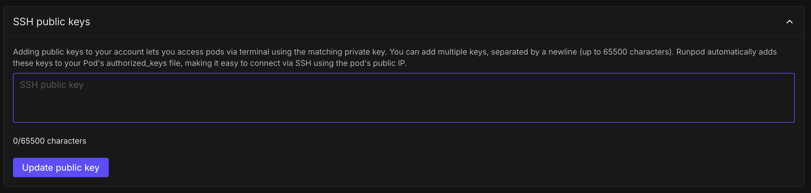
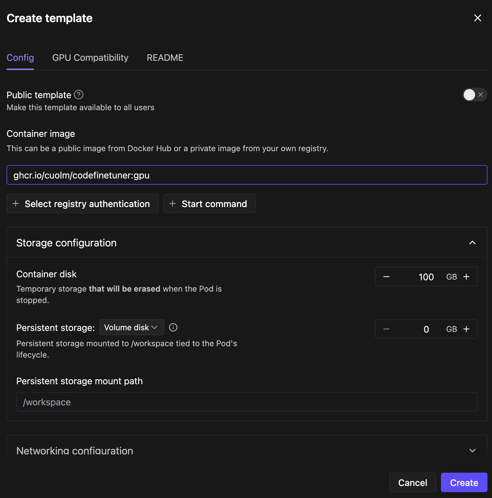
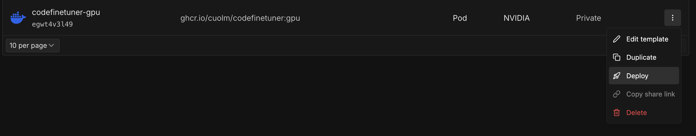

# RunPod Setup Guide

This guide walks through setting up a RunPod Pod using the CodeFinetuner GPU Docker image, connecting via SSH, and optionally attaching VS Code for remote development.

## Step 1: Create a RunPod Account
Go to [runpod.io](https://www.runpod.io/) and sign up, or sign in if you already have an account. Add prepaid credit to your account under **Billing** (e.g. $50).

## Step 2: Add Your SSH Key
Go to **Settings** and add your SSH public key so RunPod can automatically inject it into your Pods.



For more details, see the official [RunPod SSH documentation](https://docs.runpod.io/pods/configuration/use-ssh).

## Step 3: Create a Template
Navigate to the **Templates** section and click **New Template**.

- **Container name:** e.g. `codefinetuner-gpu`
- **Container image:** the project's latest GPU Docker image, `ghcr.io/cuolm/codefinetuner:gpu`
- **Container disk:** set an appropriate size based on your fine-tuning requirements (model size, codebase size, etc.)

Click **Create**.



## Step 4: Deploy the Pod
Click the three-dot menu next to your template and select **Deploy**. Choose a GPU based on your project requirements (model size, codebase size, etc.), then click **Deploy On-Demand**.



## Step 5: Connect to the Pod
Wait for the Pod to finish initializing, then go to **Connect** and copy the SSH over exposed TCP command. Run it in your terminal:

```bash
ssh root@POD_IP -p POD_PORT -i ~/.ssh/id_ed25519
```

Note: Replace `POD_IP` and `POD_PORT` with the values shown on your Pod's Connect page.

## Optional: Connect via VS Code
1. Install the [Remote - SSH extension](https://marketplace.visualstudio.com/items?itemName=ms-vscode-remote.remote-ssh) from the VS Code Marketplace.
2. Open the Command Palette:
   - Windows/Linux: `Ctrl` + `Shift` + `P`
   - macOS: `Cmd` + `Shift` + `P`
3. Select **Remote-SSH: Add New SSH Host** and paste the SSH command from the RunPod Connect page:
```bash
   ssh root@POD_IP -p POD_PORT -i ~/.ssh/id_ed25519
```
   Note: Replace `POD_IP` and `POD_PORT` with your Pod's actual values.
4. Follow the setup steps, then click **Open Folder** and specify `/app`.

You are now at the root of the project inside the Pod. See the fine-tuning examples under `root/examples` for full fine-tuning runs.